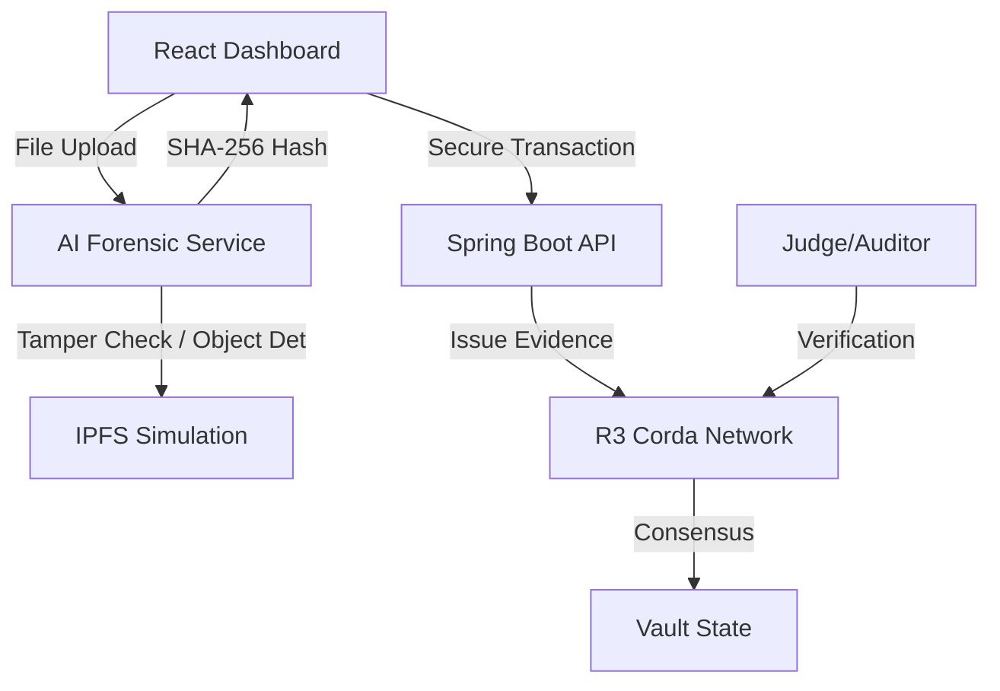

<p align="center">
  
</p>

# SECURELOCK: AI-Powered Blockchain Forensic Vault 🛡️

###
**SecureLock** is a decentralized application (dApp) designed to revolutionize digital evidence management. It bridges the gap between physical evidence collection and courtroom admissibility by leveraging **Enterprise Blockchain**, **Computer Vision AI**, and **Distributed Storage**.

---

## 🏗️ The Challenge
Traditional evidence lockers are prone to human error, tampering, and chain-of-custody breaks. SecureLock ensures that from the moment evidence is "anchored," it is mathematically impossible to alter its record without detection.

## 🚀 Key Features
- **🧠 Forensic AI Cluster**: Automated Object Detection (weapons, contraband) and Metadata/Pixel-level Tamper Analysis.
- **🔗 Enterprise Ledger (R3 Corda)**: Immutable, legally-defensible record-keeping with identity-based consensus.
- **📦 Distributed Storage (IPFS)**: Evidence files are secured via cryptographic hashing and pinned to a distributed network.
- **✨ Glassmorphism UI**: A state-of-the-art dashboard built for Law Enforcement Officers and Judicial Auditors.
- **🛡️ Chain of Custody**: Automated, real-time visualization of evidence ownership and transfer history.

---

## 🛠️ System Architecture



### Tech Stack:
- **Blockchain**: Java R3 Corda 4.x
- **Frontend**: React 18, Vite, Tailwind CSS v4, Lucide
- **AI Service**: Python Flask, OpenCV, ExifRead
- **Database**: H2 (In-memory nodes)

---

## 🚦 Getting Started

### Prerequisites
- **Java**: JDK 1.8 (Corda 4 requirements)
- **Python**: 3.8+
- **Node**: 18+

### Setup & Installation
1.  **Clone the Repository**:
    ```bash
    git clone https://github.com/[YOUR_USERNAME]/secure-evidence-locker.git
    cd secure-evidence-locker
    ```
2.  **Run the Launch Script**:
    We've provided a comprehensive one-click script that starts everything:
    ```bash
    chmod +x run_demo.sh
    ./run_demo.sh
    ```

---

## 👥 Roles & Workflows

### 👮 Law Enforcement Officer (Submitter)
1. **Primary Ingest**: Drag and drop crime scene photos into the **Deposit Case** portal.
2. **AI Verification**: Launch the Forensic Pipeline to check for tampering and auto-tag objects.
3. **Ledger Anchor**: Sign with a biometric key and commit to the Corda Ledger.

### ⚖️ Judicial Auditor / Judge (Verifier)
1. **Court Ingest**: Drag a presented file into the **Court Verification** portal.
2. **Consensus Check**: The system performs a live 1:1 hash comparison against the Corda network.
3. **Admissibility Cert**: If authentic, a timestamped blockchain certificate is generated for legal record.

---

## 🔒 Security & Compliance
- **SHA-256 Collision Logic**: Impossible to spoof evidence identity.
- **Identity-based Consensus**: Only authorized nodes (Police, Courts, Notaries) can validate blocks.
- **PRNU Noise Analysis**: AI detects if images have been edited or resaved.

---

## 🎓 Credit
Developed as a Final Year Project for CSE. 
Built on top of the R3 Corda Template. 
Special thanks to the Corda Community.

---
*Disclaimer: This is a prototype system demonstrating "Chain of Trust" principles.*
